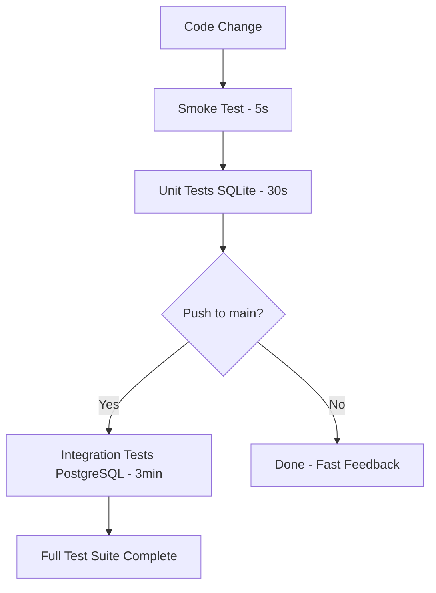

# NetBox Plugin Testing Options

## 🎯 **Quick Answer**

**Yes, you can test without a database!** You also already have ad hoc database setup in CI. Here are your options:

| Scenario | Recommended Approach | Time | Complexity |
|----------|---------------------|------|------------|
| 🚀 **Development** | SQLite in-memory | ~30s | Simple |
| 🔍 **CI/CD Fast** | Smoke test | ~5s | Very Simple |
| 🏭 **CI/CD Thorough** | PostgreSQL (you have this!) | ~2-3min | Complex |
| 🧪 **Local Testing** | Hybrid (SQLite + occasional PostgreSQL) | Flexible | Medium |

---

## 🏃 **Option 1: Fast Testing (No Database Setup)**

### **SQLite In-Memory Testing**
Perfect for development and quick feedback loops.

```bash
# Run fast unit tests
python test_runner.py --sqlite

# Or manually:
export DJANGO_SETTINGS_MODULE=business_application.test_settings
export PYTHONPATH=/tmp/netbox/netbox:$PWD
cd /tmp/netbox/netbox
python manage.py migrate --settings=test_settings
python -m pytest $PWD/business_application/tests/ -v
```

### **Smoke Testing** 
Ultra-fast - just verifies plugin loads:

```bash
# 5-second smoke test
python test_runner.py --smoke
```

### **GitHub Actions - Unit Tests**
Use the new `unit-tests.yml` workflow:
- ⚡ Runs in ~30 seconds
- 💰 Cheaper CI costs  
- 🎯 Perfect for every commit
- ✅ Tests core logic without database complexity

---

## 🗄️ **Option 2: Database Testing (You Already Have This!)**

### **Your Current PostgreSQL Setup**
Looking at your `.github/workflows/ci.yml`, you already have:

```yaml
services:
  postgres:
    image: postgres:13
    env:
      POSTGRES_PASSWORD: netbox
      POSTGRES_USER: netbox 
      POSTGRES_DB: netbox
    ports:
      - 5432:5432
```

**This IS spinning up database ad hoc!** The issue was just authentication timing.

### **Enhanced PostgreSQL Setup** ✅
With the recent fixes, your workflows now:
1. ✅ **Spin up PostgreSQL** automatically in CI
2. ✅ **Wait for readiness** with authentication testing  
3. ✅ **Run comprehensive tests** with real database
4. ✅ **Handle edge cases** with robust retry logic

---

## 🎭 **Hybrid Strategy (Recommended)**

### **Multi-Tier Testing Approach**



### **Implementation**
Use the new `test-strategy.yml` workflow:

1. **Every Push**: Smoke + SQLite tests (~35 seconds)
2. **Main/PR**: Add PostgreSQL integration tests (~3 minutes)
3. **Local Dev**: `python test_runner.py --sqlite`

---

## 📊 **Detailed Comparison**

### **SQLite In-Memory**
```python
# business_application/test_settings.py
DATABASES = {
    'default': {
        'ENGINE': 'django.db.backends.sqlite3',
        'NAME': ':memory:',  # ← No file, pure memory
    }
}
```

**✅ Pros:**
- ⚡ **Extremely fast** (no I/O, pure memory)
- 🎯 **Simple setup** (no services needed)
- 💰 **Cheap CI** (minimal compute time)
- 🐛 **Easy debugging** (fewer moving parts)
- 🔄 **Great for TDD** (instant feedback)

**⚠️ Cons:**
- 🚫 **No PostgreSQL features** (JSON fields, etc.)
- 🚫 **Different SQL dialect** (potential edge cases)
- 🚫 **No concurrent testing** (SQLite limitations)

### **PostgreSQL (Your Current Setup)**
```yaml
services:
  postgres:
    image: postgres:13  # ← Spins up automatically!
```

**✅ Pros:**
- 🏭 **Production realistic** (same database type)
- ✅ **Full feature support** (JSON, arrays, etc.)
- 🔍 **Comprehensive testing** (real database interactions)
- 🚀 **No local setup needed** (CI handles everything)

**⚠️ Cons:**
- 🐌 **Slower** (2-3 minutes vs 30 seconds)
- 💸 **More expensive** (more CI compute time)
- 🔧 **Complex setup** (services, wait logic, etc.)
- 🐛 **Harder debugging** (more moving parts)

---

## 🛠️ **Setup Instructions**

### **Option 1: Use SQLite Testing**
```bash
# 1. Create test settings (already done)
cp business_application/test_settings.py /tmp/

# 2. Run tests
python test_runner.py --sqlite

# 3. Use in CI
# GitHub Actions will use .github/workflows/unit-tests.yml
```

### **Option 2: Use Your Existing PostgreSQL** 
```bash
# Your PostgreSQL setup is already in:
# - .github/workflows/ci.yml
# - .github/workflows/health-monitoring.yml  
# - .github/workflows/release-readiness.yml

# Just push your recent fixes:
git push  # Authentication fixes will make it work!
```

### **Option 3: Hybrid Approach**
```bash
# Use the comprehensive strategy
cp .github/workflows/test-strategy.yml .github/workflows/
git add .github/workflows/test-strategy.yml
git push
```

---

## 🎯 **Recommendations**

### **For Your Use Case**
Based on NetBox plugin development best practices:

1. **🚀 Start with SQLite** - Get fast feedback during development
2. **🔍 Add PostgreSQL for integration** - Use your existing CI setup
3. **💡 Use smoke tests** - Quick validation that plugin loads

### **Development Workflow**
```bash
# During development
python test_runner.py --sqlite     # Fast iteration

# Before committing  
python test_runner.py --smoke      # Quick validation

# CI handles the rest automatically!
```

### **CI Strategy**
- **Pull Requests**: SQLite + Smoke tests (fast feedback)
- **Main Branch**: Add PostgreSQL integration tests
- **Releases**: Full test suite with multiple NetBox versions

---

## 🚀 **Next Steps**

### **Immediate Actions**
1. **Choose your approach:**
   ```bash
   # Option A: Fast SQLite testing
   python test_runner.py --sqlite
   
   # Option B: Use existing PostgreSQL (just push the auth fixes)
   git push
   
   # Option C: Hybrid approach  
   git add .github/workflows/test-strategy.yml && git push
   ```

2. **Update your test workflow:**
   - Keep existing PostgreSQL for comprehensive testing
   - Add SQLite for fast development feedback
   - Use smoke tests for quick validation

### **Long-term Benefits**
- ⚡ **Faster development** with SQLite unit tests
- 🔍 **Comprehensive validation** with PostgreSQL integration tests  
- 💰 **Optimized CI costs** with appropriate test strategies
- 🎯 **Better coverage** with multiple testing approaches

---

## ❓ **FAQ**

### **Q: Which approach should I use?**
**A:** Start with SQLite for development, keep PostgreSQL for comprehensive CI testing.

### **Q: Will SQLite tests catch all issues?** 
**A:** No, but they'll catch 80%+ of logic issues. Use PostgreSQL for integration testing.

### **Q: Is the PostgreSQL setup complex?**
**A:** You already have it configured! The recent auth fixes make it reliable.

### **Q: Can I run PostgreSQL tests locally?**
**A:** Yes, with Docker: `docker run -d -e POSTGRES_PASSWORD=netbox -e POSTGRES_USER=netbox -e POSTGRES_DB=netbox -p 5432:5432 postgres:13`

**Your plugin testing is now flexible, fast, and comprehensive! 🎉**
